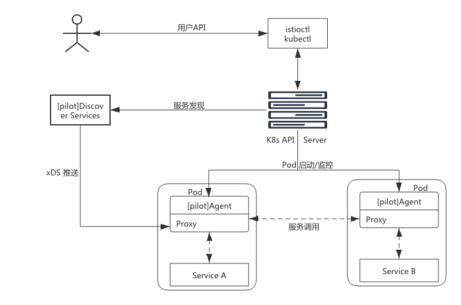
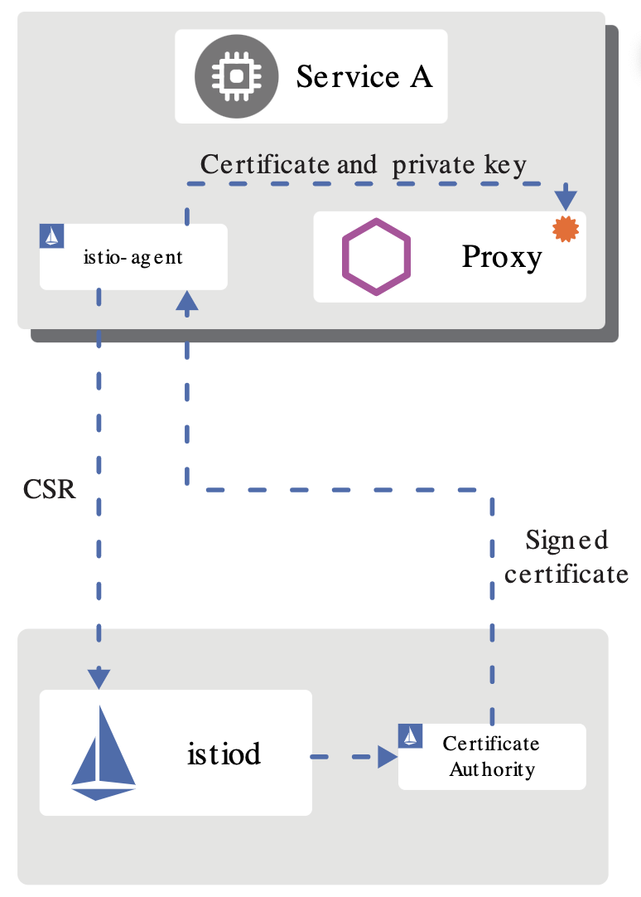

# 控制平面

控制平面是控制和管理数据平面中的 Sidecar 代理，完成配置分发、服务发现、流量路由、授权鉴权等功能，以达到对数据平面的统一管理。

在 Istio 1.5 版本之前，`Mixer` 组件负责遥测统计（`istio-telemetry`）和策略控制（`istio-policy`），其中提供了两个接口 check 和 report，在每次 Sidecar 代理发送请求时都会去 Mixer 里 check 一次，然后 report 观测信息给 Mixer，Mixer 加工后发送给 `Prometheus`。因此，基于性能、部署方便的考虑，在 Istio 1.5 版本中废弃了 Mixer 组件，转而将这些功能放到了 Sidecar 中。

在 Istio 1.5 版本中，控制平面由原来分散、独立部署的几个组件整合为一个独立的 [istiod](https://istio.io/latest/news/releases/1.5.x/announcing-1.5/upgrade-notes/#istiod)，变成了一个单进程、多模块的组织形态。`istiod` 是新版本中最大的变化，以一个单体组件替代了原有的架构，在降低复杂度和维护难度的同时，也让易用性得到提升。需要注意的一点是，原有的多组件并不是被完全移除，而是在重构后以模块的形式整合在一起组成了 `istiod`。

目前，控制平面依旧延续之前组件的功能，但以模块的形式呈现在 `istiod` 中，包括 `Pilot`、`Citadel`、`Galley` 三个模块，本节将会详细介绍它们。

## 1、Pilot

`Pilot` 是 Istio 中的核心组件，用于管理和配置部署在特定 Istio 服务网格中的所有 Sidecar 代理实例。它管理 Sidecar 代理之间的路由流量规则，并配置故障恢复功能，如超时、重试和熔断等。

### 1.1 Pilot 架构

根据上图，Pilot 有几个关键模块如下：

#### 抽象模型（Abstract model）

为了实现对不同服务注册中心 （如，`Kubernetes`、`Consul`） 的支持，`Pilot` 需要对不同输入来源的数据有一个统一的存储格式，也就是抽象模型。

抽象模型中定义的关键成员包括 `HostName`（service 名称）、`Ports`（service 端口）、`Address`（service ClusterIP）、`Resolution` （负载均衡策略） 等。

#### 平台适配器 （Platform adapters）

`Pilot` 的实现是基于平台适配器（`Platform adapters`） 的，借助平台适配器 `Pilot` 可以实现服务注册中心数据到抽象模型之间的数据转换。

例如，`Pilot` 中的 `Kubernetes` 适配器通过 `Kubernetes API Server` 获得 `Kubernetes` 中 service 和 Pod 的相关信息，然后翻译为抽象模型提供给 `Pilot` 使用。

通过平台适配器模式，`Pilot` 还可以从 `Consul` 等平台中获取服务信息，还可以开发适配器将其他提供服务发现的组件集成到 `Pilot` 中。

#### xDS API

`Pilot` 使用了一套源于 Envoy 项目的标准数据平面 API 来将服务信息和流量规则下发到数据面的 Sidecar 中。这套标准数据平面 API，也叫 `xDS`。

Sidecar 通过 `xDS API` 可以动态获取 `Listener` （监听器）、`Route` （路由）、`Cluster`（集群）及 `Endpoint` （集群成员）及 `Secret`（安全）配置：

- LDS：`Listener` 发现服务。Listener 监听器控制 Sidecar 启动端口的监听（目前只支持 TCP 协议），并配置 `L3/L4` 层过滤器，当网络连接达到后，配置好的网络过滤器堆栈开始处理后续事件。
- RDS：`Route` 发现服务，用于 HTTP 连接管理过滤器动态获取路由配置，路由配置包含 HTTP 头部修改（增加、删除 HTTP 头部键值），virtual hosts （虚拟主机），以及 virtual hosts 定义的各个路由条目。
- CDS：`Cluster` 发现服务，用于动态获取 Cluster 信息。
- EDS：`Endpoint` 发现服务。用于动态维护端点信息，端点信息中还包括负载均衡权重、金丝雀状态等，基于这些信息，Sidecar 可以做出智能的负载均衡决策。
- SDS：`Secret` 发现服务，用于运行时动态获取 TLS 证书。

通过采用该标准 API， Istio 将控制平面和数据平面进行了解耦，为多种数据平面 Sidecar 实现提供了可能性。例如蚂蚁金服开源的 Golang 版本的 Sidecar [MOSN (Modular Observable Smart Network)](https://github.com/mosn/mosn)。

#### 用户 API（User API）

`Pilot` 还定义了一套用户 API， 用户 API 提供了面向业务的高层抽象，可以被运维人员理解和使用。

运维人员使用该 API 定义流量规则并下发到 `Pilot` ，这些规则被 `Pilot` 翻译成数据平面的配置，再通过 `xDS API` 分发到 Sidecar 实例，可以在运行期对微服务的流量进行控制和调整。

通过运用不同的流量规则，可以对网格中微服务进行精细化的流量控制，如按版本分流、断路器、故障注入、灰度发布等。

### 1.2 Pilot 实现

图中实线连线表示控制流，虚线连线表示数据流。带 `[pilot]` 的组件表示为 `Pilot` 组件，图中关键的组件如下：

- **Discovery service**：即 `pilot-discovery`，主要功能是从注册中心（如 Kubernetes 或者 Consul ）中获取服务信息，从 `Kubernetes API Server` 中获取流量规则（`Kubernetes CRD Resource`），并将服务信息和流量规则转化为数据平面可以处理的格式，通过标准的数据平面 API 下发到网格中的各个 Sidecar 中。
- **Agent**：即 `pilot-agent` 组件，该进程根据 `Kubernetes API Server` 中的配置信息生成 Envoy 的配置文件，负责启动、监控 Sidecar 进程。
- **Proxy**：既 Sidecar Proxy，是所有服务的流量代理，直接连接 `pilot-discovery` ，间接地从 Kubernetes 等服务注册中心获取集群中微服务的注册情况。
- **Service A/B**：使用了 Istio 的应用，如 Service A/B，进出网络流量会被 Proxy 接管。

其中，`Pilot` 实际上包括 `pilot-discovery` 和 `pilot-agent` 两个组件，分别位于控制平面和数据平面。

#### pilot-discovery

pilot-discovery 位于控制平面，扮演服务发现、控制平面到 Sidecar 之间的桥梁作用。`pilot-discovery` 的主要功能如下：

- 监控服务注册中心（如 Kubernetes）的服务注册情况。在 Kubernetes 环境下，会监控 service、endpoint、pod、node 等资源信息。
- 监控 Istio 控制平面信息变化，在 Kubernetes 环境下，会监控包括 `RouteRule`、 `VirtualService`、`Gateway`、`EgressRule`、`ServiceEntry` 等以 `Kubernetes CRD` 形式存在的 Istio 控制面配置信息。
- 将上述两类信息合并组合为 Sidecar 可以理解的配置信息，并将这些信息以 gRPC 协议提供给 Sidecar。

#### pilot-agent

`pilot-agent` 位于数据平面，是一个本地代理，与 Sidecar 代理部署在一起，负责 Sidecar 服务的整个生命周期。`pilot-agent` 的主要功能如下：

- 生成 Sidecar 的配置。
- 负责 Sidecar 的启动与监控。

## 2、Citadel

`Citadel` 是 Istio 中负责身份认证和证书管理的核心安全组件，1.5 版本之后取消了独立进程，作为一个功能模块被整合在 istiod 中。

### 2.1 Citadel 基本功能

总体来说，Istio 在安全架构方面主要包括以下内容：

- 证书签发机构（`CA`）负责密钥和证书管理。
- API 服务器将安全配置分发给数据平面。
- 客户端、服务端通过代理安全通信。

Istio 的身份标识模型使用一级服务标识来确定请求的来源，它可以灵活的标识终端用户、工作负载等。在平台层面，Istio 可以使用类似于服务名称来标识身份，或直接使用平台提供的服务标识。比如 Kubernetes 的 `ServiceAccount`，`AWS IAM` 用户、角色账户等。

在身份和证书管理方面，Istio 使用 `X.509` 证书，并支持密钥和证书的自动轮换。从 1.1 版本开始，Istio 开始支持安全发现服务器（`SDS`），随着不断的完善和增强，1.5 版本 `SDS` 已经成为默认开启的组件。Citadel 以前有两个功能：将证书以 Secret 的方式挂载到命名空间里；通过 SDS gRPC 接口与 `nodeagent`（已废弃）通信。目前 Citadel 只需要完成与 SDS 相关的工作，其他功能被移动到了 istiod 中。

### 2.2 Citadel 工作原理

`Citadel` 主要包括 `CA` 服务器、`SDS` 服务器、证书密钥控制器等模块，它们的工作原理如下：

#### CA 服务器

`Citadel` 中的 CA 签发机构是一个 gRPC 服务器，启动时会注册两个 gRPC 服务，一个是 CA 服务，用来处理 CSR 请求（`certificate signing request`）；另外一个是证书服务，用来签发证书。CA 首先通过 HandleCSR 接口处理来自客户端的 CSR 请求，对客户端进行身份验证（包括 TLS 认证和 JWT 认证），验证成功后会调用 `CreateCertificate` 进行证书签发。

#### SDS 服务器

SDS， 即安全发现服务（Secret Discovery Service），它是一种在运行时动态获取证书私钥的 API，Envoy 代理通过 SDS 动态获取证书私钥。Istio 中的 SDS 服务器负责证书管理，并实现了安全配置的自动化。相比传统的方式，使用 SDS 主要有以下优点：

- 无需挂载 Secret 卷；
- 动态更新证书，无需重启；
- 可以监听多个证书密钥对。

目前的版本中，SDS 是默认开启的，它的工作流程如下：

- Envoy 通过 SDS API 发送证书和密钥请求；
- istio-agent 作为 Envoy 的代理，创建一个私钥和证书签名请求（CSR），并发送给 istiod；
- CA 机构验证收到的 CSR 并生成证书；
- istio-agent 将私钥和从 istiod 收到的证书通过 SDS API 发送给 Envoy；
- 以上流程周期性执行实现密钥和证书轮换。

#### 证书密钥控制器

证书密钥控制器（`CaSecretController`）监听 `istio.io/key-and-cert` 类型的 `Secret` 资源，它会周期性的检查证书是否过期，并更新证书。

#### 证书轮换

如果没有自动证书轮换功能，当证书过期时，就不得不重启签发，并重启代理。证书轮换解决了这一问题，提高了服务的可用性。Istio 里通过一个轮换器（`Rotator`）自动检查自签名的根证书，并在证书即将过期时进行更新，它本质上是一个协程（`goroutine`）在后台轮询实现的：

- 获取当前证书，解析证书的有效期并获取下一次轮换时间。
- 启动定时器，如果发现证书到达轮换时间，从 CA 获取最新的证书密钥对。
- 更新证书。

## 3、Galley

`Galley` 是不直接向数据平面提供业务能力，而是在控制平面上向其他模块提供支持。

`Galley` 作为负责配置管理的模块，验证配置信息的格式和内容的正确性，并将这些配置信息提供给控制平面的 `Pilot` 使用，这样控制平面的其他模块只用和 `Galley` 交互，从而与底层平台解耦。使用简单的接口和 `Galley` 进行交互，由 `Galley` 负责配置验证、配置变更管理、配置源管理、多平台适配等工作。
