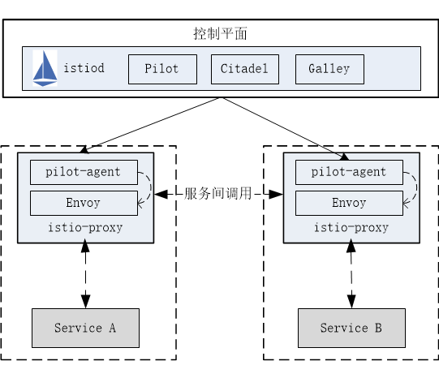

# 数据平面

Istio 数据平面的核心是以 Sidecar 方式存在的代理，该 Sidecar 将数据平面核心组件部署到单独的流程或容器中，以提供隔离和封装。Sidecar 与应用服务共享相同的生命周期，与应用服务一起创建、退出。Sidecar 与参与服务网格的所有应用服务实例一起运行，但不在同一个容器进程中，形成了服务网格的数据平面。只要应用服务想要与其他服务通信，就会通过服务 Sidecar 代理进行。

如下图所示，数据平面的 Sidecar 代理可以调节和控制应用服务之间所有的网络通信，每个应用服务 Pod 启动时会伴随启动 `istio-init` 和 `istio-proxy` 容器。其中 `istio-init` 容器主要功能是初始化 Pod 网络和对 Pod 设置 `iptable` 规则，设置完成后自动结束。`istio-proxy` 容器会启动两个进程：`pilot-agent` 以及 `Sidecar` 代理（如：`Envoy`）。`pilot-agent` 的作用是同步管理数据，启动并管理 Sidecar 代理服务进程，上报遥测数据，Sidecar 代理则根据管理策略完成流量管控、生成遥测数据。

在 Istio 中，数据平面主要负责提供以下能力：

- **服务发现**：探测所有可用的上游或下游服务实例。

- **健康检测**：探测上游或下游服务实例是否健康，是否准备好接收网络流量。

- **流量路由**：将网络请求路由到正确的上游或下游服务。

- **负载均衡**：在对上游或下游服务进行请求时，选择合适的服务实例接收请求，同时负责处理超时、断路、重试等情况。

- **身份验证和授权**：在 `istio-agent` 与 `istiod` 配合下，对网络请求进行身份验证、权限验证，以决定是否响应以及如何响应，使用 `mTLS` 或其他机制对链路进行加密等。

- **链路追踪**：对于每个请求，生成详细的统计信息、日志记录和分布式追踪数据，以便操作人员能够理解调用路径并在出现问题时进行调试。

目前常见的数据平面实现有：

- [Envoy](https://www.envoyproxy.io/docs/envoy/latest/)：Istio 默认使用的开箱即用 Sidecar 代理，使用 C++ 开发，性能较高。
- [MOSN](https://mosn.io/)：阿里巴巴公司开源，设计类似 Envoy，使用 Go 语言开发，对多协议进行了支持。
- [Linkerd](https://linkerd.io/)：一个提供弹性云端原生应用服务网格的开源项目，也是面向微服务的开源 RPC 代理，使用 Scala 开发。它的核心是一个透明代理，因此也可作为典型的数据平面的实现。

下面将对数据平面涉及到的容器或组件进行具体说明。

## 1、isito-init

## 2、istio-proxy 和 pilot-agent

## 3、Envoy
