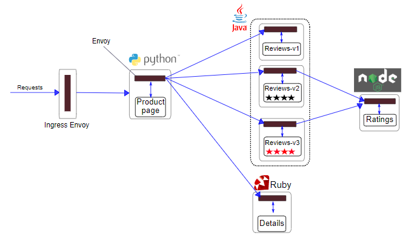
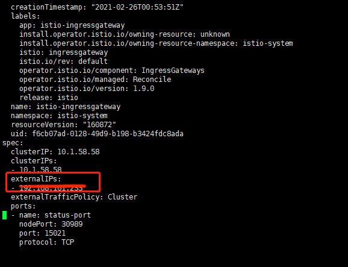

# 部署示例

部署官方 [Bookinfo 示例应用](https://istio.io/latest/docs/examples/bookinfo/)。

该示例部署了一个用于演示多种 Istio 特性的应用，该应用由四个单独的微服务构成。 这个应用模仿在线书店的一个分类，显示一本书的信息。 页面上会显示一本书的描述，书籍的细节（ISBN、页数等），以及关于这本书的一些评论。

`Bookinfo` 应用分为四个单独的微服务：

- `productpage`：这个微服务会调用 `details` 和 `reviews` 两个微服务，用来生成页面。
- `details`：这个微服务中包含了书籍的信息。
- `reviews`：这个微服务中包含了书籍相关的评论。它还会调用 `ratings` 微服务。
- `ratings`：这个微服务中包含了由书籍评价组成的评级信息。

`reviews` 微服务有 3 个版本：

- v1 版本不会调用 `ratings` 服务。
- v2 版本会调用 `ratings` 服务，并使用 1 到 5 个黑色星形图标来显示评分信息。
- v3 版本会调用 `ratings` 服务，并使用 1 到 5 个红色星形图标来显示评分信息。

下图展示了这个应用的端到端架构。



## 1、部署服务

1. 进入 Istio 安装目录。

2. Istio 默认 [自动注入 sidecar](https://istio.io/latest/docs/setup/additional-setup/sidecar-injection/#automatic-sidecar-injection)。请为 `default` 命名空间打上标签 `istio-injection=enabled`：

   ```sh
   $ kubectl label namespace default istio-injection=enabled
   namespace/default labeled
   ```

3. 使用 `kubectl apply -f` 命令部署应用：

   ```sh
   kubectl apply -f samples/bookinfo/platform/kube/bookinfo.yaml
   ```

4. 确认所有的服务和 Pod 都已经正确的定义和启动：

   ```sh
   kubectl get service

   kubectl get pod
   ```

5. 要确认 `Bookinfo` 应用是否正在运行，请在某个 Pod 中用 `curl` 命令对应用发送请求，例如 `ratings`：

   ```sh
   kubectl exec -it $(kubectl get pod -l app=ratings -o jsonpath='{.items[0].metadata.name}') -c ratings -- curl productpage:9080/productpage | grep -o "<title>.*</title>"
   ```

## 2、确定 Ingress 的 IP 和端口

现在 `Bookinfo` 中的所有服务都启动并运行中，您需要使应用程序可以从外部访问，例如使用浏览器。可以用 [Istio Gateway](https://istio.io/latest/zh/docs/concepts/traffic-management/#gateways) 来实现这个目标。

1. 为应用程序定义 `Ingress` 网关

   ```sh
   kubectl apply -f samples/bookinfo/networking/bookinfo-gateway.yaml
   ```

2. 确认网关创建完成

   ```sh
   $ kubectl get gateway
   NAME               AGE
   bookinfo-gateway   32s
   ```

3. 确认 `Ingress` 的 IP 和端口

   执行如下命令，明确自身 Kubernetes 集群环境支持外部负载均衡：

   ```sh
   kubectl get svc istio-ingressgateway -n istio-system
   ```

   如果 `EXTERNAL-IP` 值存在，则说明环境正在使用外部负载均衡，可以用其为 ingress gateway 提供服务。如果 `EXTERNAL-IP`值为 `<none>`（或持续显示 `<pending>`），则说明环境没有提供外部负载均衡，无法使用 ingress gateway。可通过设置 `EXTERNAL-IP` 值，从外部访问。

4. 设置 `EXTERNAL-IP`

   执行如下命令，添加 `EXTERNAL-IP` 值，即：设置外部访问，常设置为 master 的 IP。

   ```sh
   kubectl edit  service istio-ingressgateway -n istio-system
   ```

   

   确认 `istio-ingressgateway` 的 `EXTERNAL-IP` 值是否设置成功：

   ```sh
   kubectl get  service istio-ingressgateway -n istio-system
   ```

## 3、确认可以从集群外部访问应用

用浏览器打开网址 `http://<EXTERNAL-IP>/productpage`，来浏览应用的 Web 页面。如果刷新几次应用的页面，就会看到 `productpage` 页面中会随机展示 `reviews` 服务的不同版本的效果（红色、黑色的星形或者没有显示）。`reviews` 服务出现这种情况是因为我们还没有使用 Istio 来控制版本的路由。


接下来的 Istio 学习中，可以使用此示例来验证 Istio 的流量路由、故障注入等功能。

## 4、卸载示例应用

当完成 `Bookinfo` 示例的实验后，如有需要可按照以下说明进行卸载和清理：

1. 删除路由规则，并终止应用程序容器

   ```sh
   samples/bookinfo/platform/kube/cleanup.sh
   ```

2. 确认卸载

   ```sh
   kubectl get virtualservices   #-- there should be no virtual services
   kubectl get destinationrules  #-- there should be no destination rules
   kubectl get gateway           #-- there should be no gateway
   kubectl get pods              #-- the Bookinfo pods should be deleted
   ```
