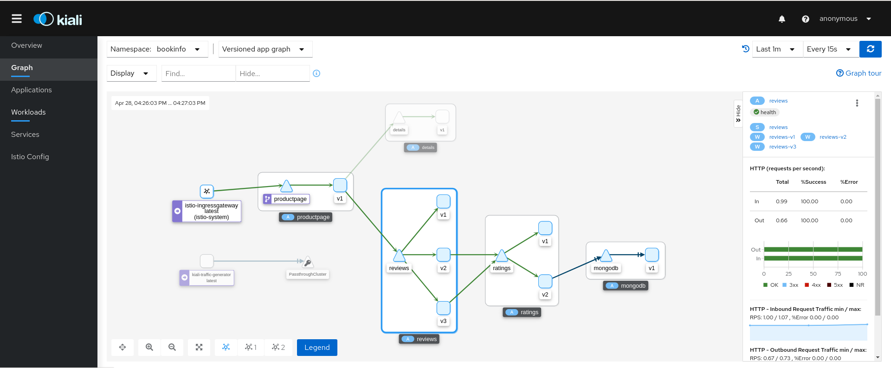

# 部署 Dashboard

Istio 和几个遥测应用做了集成。 能帮你了解服务网格的结构、展示网络的拓扑结构、分析网格的健康状态等。

使用下面说明部署 [Kiali](https://istio.io/latest/docs/ops/integrations/kiali/) 仪表板、 以及 [Prometheus](https://istio.io/latest/docs/ops/integrations/prometheus/)、 [Grafana](https://istio.io/latest/docs/ops/integrations/grafana)、 还有 [Jaeger](https://istio.io/latest/docs/ops/integrations/jaeger/)。

1. 安装 [Kiali 和其他插件](https://github.com/istio/istio/tree/release-1.9/samples/addons)，等待部署完成。

   如果在安装插件时出错，再运行一次命令。 有一些和时间相关的问题，再运行就能解决。

   ```sh
   $ kubectl apply -f samples/addons
   $ kubectl rollout status deployment/kiali -n istio-system
   Waiting for deployment "kiali" rollout to finish: 0 of 1 updated replicas are available...
   deployment "kiali" successfully rolled out
   ```

2. 访问 `Kiali` 仪表板。

   ```sh
   istioctl dashboard kiali --address 192.168.161.233
   ```

   > `--address`：Kiali 仪表板监听地址，即：用于访问的IP。

3. 用浏览器打开网址 `http://<--address>:20001/kiali`，就可以访问 Kiali 仪表板。在左侧的导航菜单，选择 *Graph* ，然后在 *Namespace* 下拉列表中，选择 *default* 。

   Kiali 仪表板展示了网格的概览、以及 Bookinfo 示例应用的各个服务之间的关系。 它还提供过滤器来可视化流量的流动。


