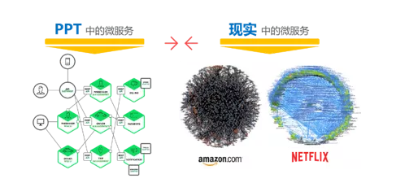
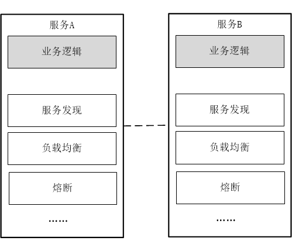
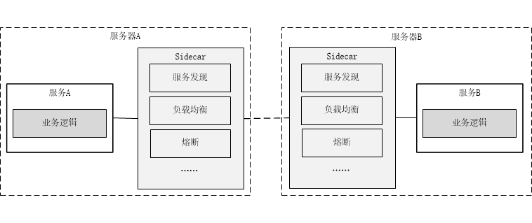
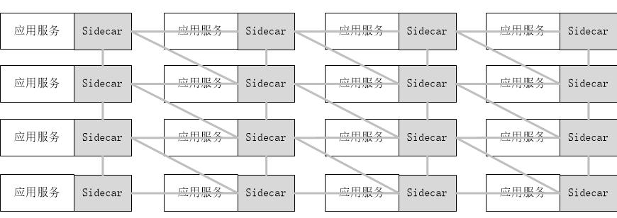

# 迎接新一代微服务架构

微服务是近些年来软件架构中的热名词，也是一个很大的概念，不同人对它的理解都各不相同，甚至在早期微服务架构中出现了一批四不像的微服务架构产品，有人把单纯引入 `Spring Boot`、`Spring Cloud` 等框架的应用服务也称之为微服务架构，但这却只是将它作为服务的 `Web` 容器而已。

随着微服务的火热，越来越多的团队开始实践，将微服务纷纷落地，并投入生产。但随着微服务规模的不断壮大，每增加一个微服务，就可能会增加一些依赖的基础设施和第三方的配置，比如 `Kafka` 、`Redis` 实例等，相应 `CI/CD` 的配置也会增加或调整。 同时随着微服务数量增多、业务复杂性的提升及需求的多样性等（如，对接第三方异构系统等），服务间通信的错综复杂，一步步地将微服务变得更加臃肿，服务治理也是难上加难，而这些问题在单体架构中是很容易解决的。为此，有人开始怀疑当初微服务化是否是明智之选，甚至考虑回归到传统单体应用。

正如下图所示，`PPT` 中的微服务总是美好的，但现实中的微服务却是一团糟糕，想甩甩不掉，越看越糟心。难道就没有办法了么？

## 1、传统微服务架构面临的挑战

面对上述暴露出的问题，并在传统微服务架构下，经过实践的不断冲击，面临了更多新的挑战，综上所述，产生这些问题的原因有以下这几点：

- **过于绑定特定技术栈。** 当面对异构系统时，需要花费大量精力来进行代码的改造，不同异构系统可能面临不同的改造。
- **代码侵入度过高。** 开发者往往需要花费大量的精力来考虑如何与框架或 `SDK` 结合，并在业务中更好的深度融合，对于大部分开发者而言都是一个高曲线的学习过程。
- **多语言支持受限。** 微服务提倡不同组件可以使用最适合它的语言开发，但是传统微服务框架，如 `Spring Cloud` 则是 `Java` 的天下，多语言的支持难度很大。这也就导致在面对异构系统对接时的无奈，或选择退而求其次的方案了。
- **老旧系统维护难。** 面对老旧系统，很难做到统一维护、治理、监控等，在过度时期往往需要多个团队分而管之，维护难度加大。

上述这些问题在传统微服务架构中都是在所难免，我们都知道**技术演进来源于实践中不断的摸索，将功能抽象、解耦、封装、服务化。** 随着传统微服务架构暴露出的这些问题，将迎来新的挑战，让大家纷纷寻找其他解决方案。

## 2、迎来新一代微服务架构

为了解决传统微服务面临的问题，以应对全新的挑战，微服务架构也进一步演化，最终催生了`Service Mesh` 的出现，迎来了新一代微服务架构，也被称为“下一代微服务”。为了更好地理解 `Service Mesh` 的概念和存在的意义，我们来回顾一下这一演进过程。

### 1.1 耦合阶段

在微服务架构中，服务发现、负载均衡、熔断等能力是微服务架构中重要的组成部分。微服务化之后，服务更加的分散，复杂度变得更高，起初开发者将诸如熔断、超时等功能和业务代码封装在一起，使服务具备了网络管控的能力，如下图所示。

这种方案虽然易于实现，但从设计角度来讲却存在一定的缺陷。

- 基础设施功能（如，服务发现，负载均衡、熔断等）和业务逻辑高度耦合。
- 每个微服务都重复实现了相同功能的代码。
- 管理困难。如果某个服务的负载均衡发生变化，则调用它的相关服务都需要更新变化。
- 开发者不能集中精力只关注于业务逻辑开发。

### 1.2 公共库 SDK

基于上面存在的问题，很容易会想到将基础设施功能设计为一个公共库 `SDK`，让服务的业务逻辑与这些公共功能降低耦合度，提高重复利用率，更重要的是开发者只需要关注公共库 `SDK` 的依赖及使用，而不必关注实现这些公共功能，从而更加专注于业务逻辑的开发，比如 `Spring Cloud` 框架是类似的方式。如下图所示：

实际上即便如此，它仍然有一些不足之处。

- 这些公共库 `SDK` 存在较为陡峭的学习成本，需要耗费开发人员一定的时间和人力与现有系统集成，甚至需要考虑修改现有代码进行整合。
- 这些公共库 `SDK` 一般都是通过特定语言实现，缺乏多语言的支持，在对现有系统整合时有一定的局限性。
- 公共库 `SDK` 的管理和维护依然需要耗费开发者的大量精力，并需专门人员来进行管理维护。

### 1.3 Sidecar 模式

有了上面公共库 `SDK` 的启发，加上跨语言问题、更新后的发布和维护等问题，人们发现更好的解决方案是把它作为一个代理，服务通过这个透明的代理完成所有流量的控制。

这就是典型的 `Sidecar` 代理模式，也被翻译为"边车"代理，它作为与其他服务通信的桥梁，为服务提供额外的网络特性，并与服务独立部署，对服务零侵入，更不会受限于服务的开发语言和技术栈，如下图所示。

以 `Sidecar` 模式进行通信代理，实现了基础实施层与业务逻辑的完全隔离，在部署、升级时带来了便利，做到了真正的基础设施层与业务逻辑层的彻底解耦。另一方面，`Sidecar` 可以更加快速地为应用服务提供更灵活的扩展，而不需要应用服务的大量改造。`Sidecar` 可以实现以下主要功能：

- **服务注册。** 帮助服务注册到相应的服务注册中心，并对服务做相关的健康检查。
- **服务路由。** 当应用服务调用其它服务时，`Sidecar` 可以帮助从服务发现中找到相应的服务地址，完成服务路由功能。
- **服务治理。** `Sidecar` 可以完全拦截服务进出的流量，并对其进行相应的调用链跟踪、熔断、降级、日志监控等操作，将服务治理功能集中在 `Sidecar` 中实现。
- **集中管控。** 整个微服务架构体系下的所有服务完全可以通过 `Sidecar` 来进行集中管控，完成对服务的流控、下线等。

于是，应用服务终于可以做到跨语言开发、并更专注于业务逻辑的开发。

### 1.4 Service Mesh

把 `Sidecar` 模式充分应用于一个庞大的微服务架构系统，为每个应用服务配套部署一个 `Sidecar` 代理，完成服务间复杂的通信，最终就会得到一个如下图所示的网络拓扑结构，这就是 `Service Mesh`，又称之为“服务网格“。

至此，迎来了新一代微服务架构——`Service Mesh`，它彻底解决了传统微服务架构所面临的问题。
