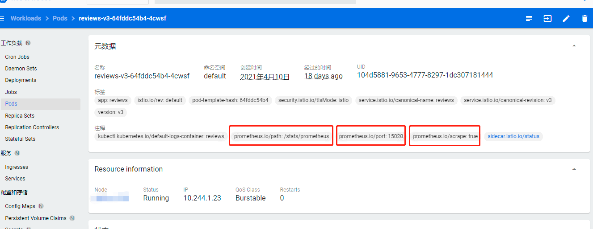

# 指标、监控和可视化

指标（`metrics`）是数据的总体汇总，它能让你了解正在发生的事情和需要深入挖掘的地方，提供了一种以聚合的方式监控和理解行为的方法。服务不断产生消费指标，这些指标是服务健康状况的持续衡量标准。

为了监控服务行为，`Istio` 为服务网格中所有出入的服务流量都生成了指标。这些指标提供了关于行为的信息，例如总流量数、错误率和请求响应时间。

在 `Istio` 中指标分为三类指标：

* 服务指标：面向服务的指标，包含了四个监控维度：延迟、流量、错误和饱和度。
* 代理指标：面向 `Sidecar`（如：`Envoy`）的指标，为所有进出流量提供了丰富的指标。
* 控制面板指标：面向控制平面的指标，用于采集 `Istiod` 自己的指标，已有的指标参考[pilot-discovery](https://istio.io/latest/docs/reference/commands/pilot-discovery/#metrics)。

各类指标通过事先埋点，通过暴露 HTTP 接口的方式让 `Prometheus` 定时抓取，将其指标数据存储至时间序列数据库（`TSDB`），且提供了多维度的数据模型、强大的查询语言（`PQL`）和简单的面板来生成被监控资源的报表，并结合 `Grafana` 将监控指标数据进行可视化展示。

## 1、Prometheus

`Prometheus` 是一款开源的、自带时序数据库的监控告警系统。目前，`Prometheus` 已成为 `Kubernetes` 集群中监控告警系统的标配。`Prometheus` 的架构如下图所示：


`Prometheus` 通过规则对 `Kubernetes` 集群中的数据源做服务发现（`Service Dicovery`），再从数据源中抓取数据，保存在它的时序数据库 `TSDB` 中。再根据配置的告警规则，将数据推给 `AlertManager` 服务，做告警信息的推送。同时，`Prometheus` 中也暴露了 `HTTP` 指标查询接口，通过 `PromQL`（一种特定的查询语法）可以将收集的数据查询并展示出来。

从上图可以看出，`Prometheus` 主要从两种数据源抓取指标：`PushGateway` 和 `Exporters`。`PushGateway` 指的是服务将指标数据主动推给 `PushGateway` 服务，`Prometheus` 再异步从 `PushGateway` 服务中抓取。而 `Exporters` 则主动暴露了 `HTTP` 服务接口，`Prometheus` 定时从接口中抓取指标。

**在 `Istio` 中，各个组件是通过暴露 `HTTP` 接口的方式让 `Prometheus` 定时抓取的（采用了 `Exporters` 的方式）。**在 `Kubernetes` 集群中，`Istio` 安装完成后，需单独执行 `$ kubectl apply -f samples/addons/prometheus.yaml` 来安装 `Prometheus`，此时会在 `istio-system` 的命名空间中部署 `Prometheus`，并将 `Istio` 组件各相关指标的数据源默认配置在 `Prometheus` 中。

关于 `Prometheus` 采集哪些数据源的指标，可直接在浏览器中打开 `Prometheus` 页面的 `Targets` 页签（`http://<Prometheus URL>:9090/targets`），查看数据源：


(也可通过查看默认 `Prometheus` 配置文件，即：`samples/addons/prometheus.yaml` 中 `ConfigMap`配置。)

其中，数据源 `kubernetes-pods` 提供了集群中 Pod 的相关指标，包括 `Istio` 的 `Sidecar` 及控制平面的相关指标。

**Prometheus 基本配置**

在 `istio` 中已经提供了关于 `Prometheus`的部署 `samples/addons/prometheus.yaml`，其默认的 `prometheus` 配置已经能够从各 `Istio` 组件中正常抓取指标数据，其默认配置是 `samples/addons/prometheus.yaml` 中 `ConfigMap` 配置。具体配置内如如下：

（由于配置文件内容太多，这里截取其中的关键部分进行说明，`#` 为注释说明部分）

```yaml
# 全局配置
global:
  evaluation_interval: 1m
  scrape_interval: 15s # 采样数据时间间隔
  scrape_timeout: 10s
# 指定规则文件，如告警规则
rule_files:
- /etc/config/recording_rules.yml
- /etc/config/alerting_rules.yml
- /etc/config/rules
- /etc/config/alerts
# 抓取指标的数据源配置，称为target，每个target用job_name命名。有静态配置和服务发现两种配置方式。
scrape_configs:
# 命名为prometheus的Targets，从localhost:9090采集指标
- job_name: prometheus
  static_configs:
  - targets:
    - localhost:9090
……
# 命名为kubernetes-pods的Target，从Kubernetes服务发现配置采集指标
- job_name: kubernetes-pods
  # Kubernetes的服务发现配置：发现Kubernetes集群中所有命名空间下的所有pod
  kubernetes_sd_configs:
  - role: pod
  # 在Prometheus抓取指标前做一些内置标签的聚合、替换、去除等操作。
  relabel_configs:
  # 采集标签__meta_kubernetes_pod_annotation_prometheus_io_scrape值为true的
  - action: keep
    regex: true
    source_labels:
    - __meta_kubernetes_pod_annotation_prometheus_io_scrape
  # 采集标签__meta_kubernetes_pod_annotation_prometheus_io_path的值，并将其替换给内置标签__metrics_path__，即：作为采集地址
  - action: replace
    regex: (.+)
    source_labels:
    - __meta_kubernetes_pod_annotation_prometheus_io_path
    target_label: __metrics_path__
  # 把标签值分别匹配([^:]+)(?::\d+)?和(\d+)正则表达式的内置标签__address__和 __meta_kubernetes_pod_annotation_prometheus_io_port的值，并合并成__address__:port的格式，替换掉原来的__address__标签值。如：内置标签__address__:10.244.1.23、__meta_kubernetes_pod_annotation_prometheus_io_port:15020，则合并后并替换完的target_label是10.244.1.23:15020
  - action: replace
    regex: ([^:]+)(?::\d+)?;(\d+)
    replacement: $1:$2
    source_labels:
    - __address__
    - __meta_kubernetes_pod_annotation_prometheus_io_port
    target_label: __address__
  - action: labelmap
    regex: __meta_kubernetes_pod_label_(.+)
  - action: replace
    source_labels:
    - __meta_kubernetes_namespace
    target_label: kubernetes_namespace
  - action: replace
    source_labels:
    - __meta_kubernetes_pod_name
    target_label: kubernetes_pod_name
  - action: drop
    regex: Pending|Succeeded|Failed
    source_labels:
    - __meta_kubernetes_pod_phase
……
```

关于更多 `Kubernetes`的服务发现配置和可用元标签的说明，可参考[kubernetes_sd_config](https://prometheus.io/docs/prometheus/latest/configuration/configuration/#kubernetes_sd_config)。

其中，`relabel_configs`：重定义标签，是在拉取(`scraping)`阶段前，修改 `target` 和它的 `labels`

* `action`：指定`relabel` 的动作，有如下值：
  * `replace`：正则匹配 `source_labels` 的值来替换 `target_labels`；
  * `keep`：正则没有匹配到 `source_labels` ，则删除 `targets`；
  * `drop`：正则匹配到 `source_labels`，则删除 `targets`；
  * `hashmod`：设置 `target_labels` 值为`source_labels` 值的 `hash`值；
  * `labelmap`：正则匹配所有标签名，将匹配的标签的值复制到由 `replace` 提供的标签名；
  * `labeldrop`：正则匹配所有标签名，匹配则移除标签；
  * `labelkeep`：正则匹配所有标签名，不匹配的标签会被移除。
* `regex`：正则表达式，用于匹配 `source_labels` 。
* `source_labels`：指定需要处理的源标签。
* `target_labels`：指定要处理后的标签。

例如，下图 `Pod` 中的元数据如下，结合上述 `Prometheus` 的数据源配置 `kubernetes-pods`，可知：`Prometheus` 将采集该 `Pod` 中的指标，采集指标地址为：`http://10.144.1.23:15020/stats/prometheus`。



## 2、Grafana

`Grafana` 是一款开源的指标数据可视化工具，有着功能齐全的度量仪表盘、图表等时序数据展示面板，支持 `Zabbix`、`InfluentDB`、`Prometheus`、`Elasticsearch`、`MySQL` 等数据源的指标展示。

在 `Istio` 中，也引入了 `Grafana` 这样一款提供了将时间序列数据库（`TSDB`）数据转换为精美的图形和可视化面板的工具。`Grafana` 让用户能够更直观地观测到集群中各项数据指标的变化趋势（网格流量变化、组件资源使用情况等），是 `Isito` 实现可观测性最重要的组件之一。

在 `Istio` 安装时，我们可以通过配置将 `Grafana` 服务默认安装在 `Istio-system` 命名空间下，`Istio` 安装完成后，默认配置了 `Istio` 中的 `Prometheus` 作为数据源，定时地从 `Prometheus` 中采集 `Istio` 各组件的指标数据，进行可视化展示。

## 3、Kiali

`Kiali` 最初是由 `Red Hat` 开源的，用于解决 `Service Mesh` 中可观察性即微服务的可视性问题。目前已获得 `Istio` 社区的官方支持。


`Kiali` 提供以下功能：

* 服务拓扑图

* 健康检查

* 指标度量收集

* 分布式跟踪

* 配置&配置校验

目前，`Kiali` 只能作为个人开发使用，功能上不够完善，在实际生产上可能还需结合实际需求开发更加完善的 `Istio` 可视化管理平台。
