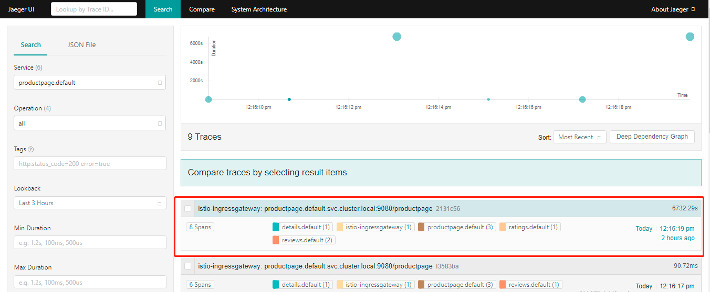

# 分布式追踪

分布式追踪通过监控流经网格的单个请求，提供了一种监控和理解行为的方法。追踪使网格的运维人员能够理解服务的依赖关系以及在服务网格中的延迟源。

`Istio` 支持通过 `Envoy` 代理进行分布式追踪。代理自动为其应用程序生成追踪 `span`，只需要应用程序转发适当的请求上下文即可。

`Istio` 支持很多追踪系统，包括 [Zipkin](https://istio.io/latest/docs/tasks/observability/distributed-tracing/zipkin/)， [Jaeger](https://istio.io/latest/docs/tasks/observability/distributed-tracing/jaeger/)，[Lightstep](https://istio.io/latest/docs/tasks/observability/distributed-tracing/lightstep/)和 [Datadog](https://www.datadoghq.com/blog/monitor-istio-with-datadog/)。

## 1、Jaeger

`Jaeger` 是由 `Uber` 开源的分布式追踪系统，它采用 `Go` 语言编写，主要借鉴了 `Google Dapper` 论文和 `Zipkin` 的设计，兼容 `OpenTracing` 以及 `Zipkin` 追踪格式，目前已成为 `CNCF` 基金会的开源项目。

`Jaeger` 主要包括以下三部分：

* `Trace`：用来描述在分布式系统中一个完整的调用链，每一个 `Trace` 会有一个独有的 `Trace ID`。一个端到端的 `Trace` 由一个或多个 Span 组成。
* `Span` ：`Span` 是 `Jaeger` 的逻辑工作单元，可以是一个微服务中的 `service`，也可以是一次方法调用，甚至一个简单的代码块调用。具有请求名称、请求开始时间、请求持续时间。每一个 `Span` 会有一个独有的 `Span ID`。`Span` 会被嵌套并排序以展示服务间的关系。

* `Span Context`：含额外 `Trace` 信息的数据结构，`span context` 可以包含 `Trace ID`、`Span ID`，以及其他任何需要向下游服务传递的 `Trace` 信息。

### 1.1 Envoy 分布式追踪 Jaeger 的实现

`Envoy` 原生支持 `Jaeger`，追踪所需 `x-b3` 开头的 `Header` 和 `x-request-id` 在不同的服务之间由业务逻辑进行传递，并由 `Envoy` 上报给 `Jaeger`，最终 `Jaeger` 生成完整的追踪信息。

为了将各种追踪 `span` 整合在一起以获得完整的追踪图，应用程序必须在传入和传出请求之间传播追踪上下文信息。特别是，`Istio` 依赖于应用程序传播 `b3` 追踪 `Header` 以及由 `Envoy` 生成的请求 `ID`，即应用程序服务请求时需携带这些 `Header`。这些 `Header` 包括：

* `x-request-id`
* `x-b3-traceid`
* `x-b3-spanId`
* `x-b3-parentspanid`
* `x-b3-sampled`
* `x-b3-flags`
* `b3`

**如果请求中没有 `B3 HTTP Header`，`Istio` `Sidecar` 代理(`Envoy`) 会自动生成初始化的 `Headers`。**

在 `Istio` 中，`Envoy` 和 `Jaeger` 的关系如下：

上图中 `Front Envoy` 指的是第一个接收到请求的 `Envoy` `Sidecar`，它会负责创建 `Root Span` 并追加到请求 `Header` 内，请求到达不同的服务时，`Envoy` `Sidecar` 会将追踪信息进行上报。

`Jaeger` 的内部组件架构与 `EFK` 日志系统架构有一定相似性：

`Jaeger` 主要由以下几个组件构成：

* `Client`：`Jaeger` 客户端，是 `OpenTracing API` 的具体语言实现，可以为各种开源框架提供分布式追踪工具。

* `Agent`：监听在 `UDP` 端口的守护进程，以 `Daemonset` 的方式部署在宿主机或以 `Sidecar` 方式注入容器内，屏蔽了 `Client` 和 `Collector` 之间的细节以及服务发现。用于接收 `Client` 发送过来的追踪数据，并将数据批量发送至 `Collector`。

* `Collector`：用来接收 `Agent` 发送的数据，验证追踪数据，并建立索引，最后异步地写入后端存储，`Collector` 是无状态的。

* `DataBase`：后端存储组件，支持内存、`Cassandra`、`Elasticsearch`、`Kafka` 的存储方式。

* `Query`：用于接收查询请求，从数据库检索数据并通过 `UI` 展示。

* `UI`：使用 `React` 编写，用于 `UI` 界面展示。

在 `Istio` 提供“开箱即用”的追踪环境中，`Jaeger` 的部署方式是 `all-in-one` 的方式。该模式下部署的 `Pod` 为 `jaeger`，使用的是 `jaegertracing/all-in-one` 镜像，包含：`Jaeger-agent`、`Jaeger-collector`、`Jaeger-query(UI)` 几个组件。

不同的是，`Bookinfo` 的业务代码并没有集成 `Jaeger-client` ，而是由 `Envoy` 将追踪信息直接上报到 `Jaeger-collector`，另外，存储方式默认为内存，随着 `Pod` 销毁，追踪数据将会被删除。

### 1.2 Jaeger 部署和验证

`Jaeger` 的部署方式主要有以下几种：

* `all-in-one` 部署：适用于快速体验 `Jaeger` ，所有追踪数据存储在内存中，不适用于生产环境。在 `Istio` 的 `demo` 环境中，就是采用该种部署方式。
* `Kubernetes` 部署：通过在集群独立部署 `Jaeger` 各组件 `manifest` 完成，定制化程度高，可使用已有的 `Elasticsearch`、`Kafka` 服务，适用于生产环境。
* `OpenTelemetry` 部署：适用于使用 `OpenTelemetry API` 的部署方式。
* `Windows` 部署：适用于 `Windows` 环境的部署方式，通过运行 `exe` 可执行文件安装和配置。

**Jaeger 部署**

`Istio` 的 `demo` 环境中，默认是没有部署 `Jaeger`，需要手动额外部署。（`Istio` 的老版本中，默认会自动部署）

1. 确认 `trace` 采样率。

   如使用 `demo` 配置安装 `Istio`，即：`istioctl install --set profile=demo` 方式安装， `trace` 采样率通过环境变量 `PILOT_TRACE_SAMPLING` 设置，`demo` 环境默认设置为 `100`，即：`100%` 采样所有请求。

   > `demo` 环境默认采样率可通过 `mainfests\proiles\demo.yaml` 文件，查看环境变量 `PILOT_TRACE_SAMPLING` 的配置值。

   > 注意：你也可以通过 `--set values.pilot.traceSampling=<Value>` 来配置采样率。`Value` 范围在 `0.0` 到 `100.0` 之间，精度为 `0.01` 。例如，`Value` 配置 `0.01` 意味着 `10000` 请求中跟踪 `1` 个请求。

2. 部署 `Jaeger`。

   执行 `kubectl apply -f samples/addons/jaeger.yaml` 来安装 `Jaeger`，此时会在 `istio-system` 的命名空间中部署 `Jaeger`。

3. 访问 `Jaeger` `Dashboard`。

   执行 `istioctl dashboard jaeger --address=<IP>` 命令启动 `dashboard`，其中 `<ip>` 是该宿主机的 `IP` 地址，方便外部直接根据该 `IP` 访问，默认端口为 `16686`。

   浏览器输入：`http://<IP>:16686`，可直接访问 `Jaeger` `Dashboard`。

   

4. 验证。

   以 `BookInfo` 示例，访问 `/productpage` 页面，使得生成并上报调用链数据，默认 100% 的采样率，则请求一次即可产生追踪链路数据。

   请求完，在 `Jaeger` `Dashboard`，选择一个 `Service` ，如 `productpage.default` ，点击 `"Find Traces"` 按钮查询追踪结果。

   （如果查询不到数据，可将 `"Lookback"` 选项的时间调大些）

   

   点击其中的列表进入追踪详情，详细记录了一次请求涉及到的 `Services`、深度、`Span` 总数、请求总时长等信息。也可以对下方的单项服务展开，观察每一个服务的请求耗时和详情。

   
