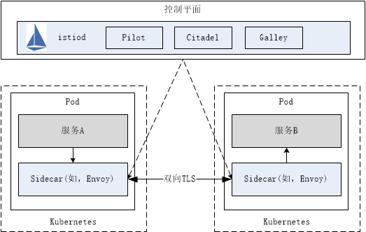

# 认证

`Istio` 基于服务维度和用户维度，提供了两种类型的认证：

* `PeerAuthentication`：用于服务到服务的认证，以验证连接的客户端服务。`Istio` 提供双向 `TLS` 作为传输认证的全栈解决方案，无需更改服务代码就可以启用它。这个解决方案：
  * 为每个服务提供强大的身份，表示其角色，以实现跨群集和云的互操作性。
  * 保护服务到服务的通信。
  * 提供密钥管理系统，以自动进行密钥和证书的生成，分发和轮换。
* `RequestAuthentication`：对请求的终端用户进行认证，以验证附加到请求的凭据。具体可通过 `JWT`（`Json Web Token`）、`Google Auth` 和自定义身份认证等方式认证。

在所有情况下，`Istio` 都通过自定义 `Kubernetes API` 将认证策略存储在 `Istio config store`。`Istiod` 使每个代理保持最新状态，并在适当时提供密钥。此外，`Istio` 的认证机制支持宽容模式（`permissive mode`，同时支持密文传输（双向 `TLS`）和明文传输），以帮助您了解策略更改在实施之前如何影响您的安全状况。

## 1、双向TLS认证

双向 `TLS` 认证是指客户端和服务端完成相互校验。

在 `Istio` 中的双向 `TLS` 认证，实际上是两个 `Sidecar` 之间首先进行双向 `TLS` 认证，认证通过后将后续的数据流进行加密传输。

例如，服务 A、服务 B 间采用双向 `TLS` 认证，当服务 A 向服务 B 发送请求时，该请求处理流程如下图所示：



流程说明：

* `Istio` 将出站流量从客户端服务 A 重新路由到客户端服务 A 的 `Sidecar`（如，`Envoy`）。
* 客户端服务 A 的 `Sidecar` 与服务端服务 B 的 `Sidecar` 开始双向 `TLS` 握手。在握手期间，客户端 `Sidecar` 还做了安全命名检查，以验证服务端证书中显示的服务帐户是否授权目标服务。
* 客户端 `Envoy` 与服务器端 `Envoy` 开始双向 `TLS` 握手。在握手期间，客户端 `Envoy` 还做了安全命名检查，以验证服务器证书中显示的服务帐户是否被授权运行目标服务。
* 客户端 `Sidecar` 和服务端 `Sidecar` 建立一个双向 `TLS` 连接，`Istio` 将流量从客户端 `Sidecar`转发到服务端 `Sidecar`。
* 授权后，服务端服务 B 的 `Sidecar` 通过本地 `TCP` 连接将流量转发到服务端服务B。

（`Sidecar` 间的双向 `TLS` 认证对于服务 A、B 而言是无感知的。）

## 2、认证策略

根据实际应用场景，认证策略分为 `PeerAuthentication` 和 `RequestAuthentication` 两种方式，下面将针对这两种认证策略展开详细说明。

### 2.1 PeerAuthentication

`PeerAuthentication`，又叫做“对等认证”，用于服务到服务的认证，以验证连接的客户端服务，对目标服务强制执行双向 `TLS` 认证模式。`Istio` 提供如下四种双向 `TLS` 身份认证模式，在不同的场景下进行使用，可通过[PeerAuthentication.MutualTLS.Mode](https://istio.io/latest/docs/reference/config/security/peer_authentication/#PeerAuthentication-MutualTLS-Mode)配置。

* `PERMISSIVE`：同时支持密文传输（双向 `TLS`）和明文传输。不管是在 `Istio` 管理下的 `Pod` 还是在 `Istio` 管理外的 `Pod`，相互之间的通信畅通无阻。`PERMISSIVE` 模式的主要用途是在用户迁移的过程中，服务与服务之间仍旧能够通信，例如部分服务并未注入 `sidecar`。对于刚接触 `Istio` 的用户而言非常友好，官方建议在完成迁移之后调整为 `STRICT` 模式。
* `STRICT`：只支持密文传输（双向 `TLS`）。
* `DISABLE`：关闭双向 `TLS`。从安全的角度而言，官方并不建议在没有其他安全措施的情况下使用该模式。
* `UNSET`： 具体的策略将从父级配置中继承（命名空间或网格层面），如果父级没有进行相应的配置，则使用 `PERMISSIVE` 模式。

例如，下面定义的 `PeerAuthentication` 认证策略：命名空间 `foo` 下所有服务都采用双向 `TLS` 认证。

```yaml
apiVersion: "security.istio.io/v1beta1"
kind: "PeerAuthentication"
metadata:
  name: "example-policy"
  namespace: "foo"
spec:
  mtls:
    mode: STRICT
```

使用 `PeerAuthentication` 认证策略，可以为不同端口指定不同的 `mTLS` 模式。例如，下面定义的 `PeerAuthentication` 认证策略：`app: example-app` 上的 80 端口禁用双向 `TLS`，其他端口采用双向 `TLS`。

```yaml
apiVersion: "security.istio.io/v1beta1"
kind: "PeerAuthentication"
metadata:
  name: "example-workload-policy"
  namespace: "foo"
spec:
  selector:
     matchLabels:
       app: example-app
  portLevelMtls:
    80:
      mode: DISABLE
```

### 2.2 RequestAuthentication

`RequestAuthentication`，又叫做"请求认证"，对请求的终端用户进行认证，以验证附加到请求的凭据。如果请求包含无效的身份验证信息，则它将基于配置的身份验证规则拒绝该请求。不包含任何身份验证凭据的请求将被接受，但不具有任何身份验证。如需对请求进行身份验证，则应附有授权规则。

具体可通过 `JWT`（`Json Web Token`）、`Google Auth` 和自定义身份认证等方式认证，这里以 `JWT` 方式展开说明。

`JWT`，是一种多方传递可信 `JSON` 数据的方案，一个 `JWT token` 由 `.` 分隔的三部分组成：`{Header}.{Payload}.{Signature}`，其中：

* `Header`： 是 `Base64` 编码的 `JSON` 数据，包含令牌类型 `typ`、签名算法 `alg` 以及秘钥 `ID kid` 等信息。
* `Payload`： 是需要传递的 `claims` 数据，也是 `Base64` 编码的 `JSON` 数据，其中有些字段是 `JWT` 标准已有的字段如：`exp`、`iat`、`iss`、`sub` 和 `aud` 等，也可以根据需求添加自定义字段。
* `Signature`： 是对前两部分的签名，防止数据被篡改，以此确保 `token` 信息是可信的，更多参考 [Introduction to JSON Web Tokens](https://jwt.io/introduction/)。`Istio` 中验签所需公钥由 `RequestAuthentication` 资源的 `JWKS` 配置提供。

可通过 `RequestAuthentication` 中的 [jwtRules](https://istio.io/latest/docs/reference/config/security/jwt/#JWTRule)配置 `JWT` 认证。

例如:

```yaml
apiVersion: security.istio.io/v1beta1
kind: RequestAuthentication
metadata:
  name: httpbin
  namespace: foo
spec:
  selector:
    matchLabels:
      app: httpbin
  jwtRules:
  - issuer: "issuer-foo"
    jwksUri: https://example.com/.well-known/jwks.json
```
