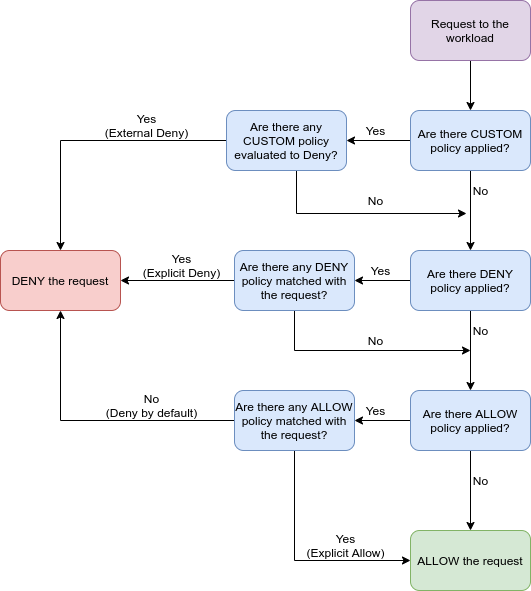

# 授权

授权，是按照预定义的配置针对特定的请求进行匹配，匹配成功之后会执行对应的动作，例如放行请求或者拒绝请求。

就像实现流量控制功能一样，`Istio` 中授权功能的实现也是非侵入式的，可以在不影响现有业务逻辑的情况下，通过一系列自定义的授权策略在 `Istio` 集群中启用授权功能，实现业务的安全加固。

用户可以通过配置授权策略来实现授权功能。授权策略按照作用域大小，可以分为三类：

* 网格级别：作用于整个服务网格集群的全局策略。
* 命名空间级别：作用于某个 `namespace` 的局部策略。
* 服务级别：作用于某些 `pod` 的具体策略。

例如：

```yaml
apiVersion: security.istio.io/v1beta1
kind: AuthorizationPolicy
metadata:
  name: allow-read
  namespace: default
spec:
  selector:
    matchLabels:
      app: products
  action: ALLOW
  rules:
  - to:
    - operation:
         methods: ["GET", "HEAD"]
```

这条授权策略会找出 命名空间 `default` 中含有 `app: products` 标签的 `pod`，针对发送到这些 `pod` 的请求进行匹配，如果这些请求使用 `HTTP` 协议，且请求方法为 `"GET"` 或者 `"HEAD"`，则放行这些请求。

## 1、授权实现

授权策略对服务器端 `Envoy` 代理中的入站流量实施访问控制。每个 `Envoy` 代理都运行一个授权引擎，该引擎在运行时对请求进行授权。当请求到达代理时，授权引擎将根据当前授权策略评估请求上下文，并返回授权结果`ALLOW` 或 `DENY`。运维人员使用`.yaml` 文件配置指定 `Istio` 授权策略。


## 2、授权策略

Istio 中的授权策略已隐式开启，无需显式开启，只需将授权策略应用于工作负载即可实施访问控制。对于未应用授权策略的工作负载，`Istio` 不会强制执行允许所有请求的访问控制。

授权策略支持 `ALLOW`，`DENY` 和 `CUSTOM` 动作。该策略动作优先级顺序为 `CUSTOM`、`DENY`、`ALLOW`。下图详细显示了策略优先级：



授权功能是通过授权策略（[`AuthorizationPolicy`](https://istio.io/latest/docs/reference/config/security/authorization-policy/)）完成配置和使用，一个授权策略包括

选择器（`selector`），动作（`action`） 和规则列表（`rules`）：

* `selector`：指定授权策略的目标。
* `action`：指定允许还是拒绝请求。
* `rules`：策略规则，指定何时触发动作。
  * `from`： 指定请求的来源
  * `to`：指定请求的操作
  * `when`：指定应用规则所需的条件

这里的 `rules` 是一个 `rule` 列表，可以指定多个规则。每一条 `rule` 规则包括三部分： `from` 、 `to` 和 `when` ，类似于防火墙规则。`from` 和 `to` 表示匹配当前请求从哪里来、到哪里去，`when` 会增加一些额外的匹配条件，当这些条件都满足时，就会认为当前规则匹配成功。如果其中某一部分未配置，则认为其可以匹配成功。

在 `rule`  中进行配置时，所有的字符串类型都支持类似于通配符的匹配模式，例如 `abc*` 匹配 `"abc"` 和 `"abcd"` 等，`*xyz` 匹配 `"xyz"` 和 `"axyz"` 等，单独的 `*` 匹配非空的字符串。

下面针对具体的字段详细进行说明。

* `from`：针对请求的发送方进行匹配，指定请求的来源，主要包括 `principals` 、 `requestPrincipals` 、 `namespaces` 和 `ipBlocks` 四个部分。
  * `principals`：匹配请求方的身份，在 `Kubernetes` 中是 `pod` 的 `Service Account`。使用这个字段时，首先需要开启 `mTLS` 功能。例如，当前请求是从命名空间 `default` 中的 `pod` 发出，且 `pod` 使用的 `Service Account` 名为 `sleep`，针对这个请求进行匹配，可将 `principals` 配置为 `[cluster.local/ns/default/sa/sleep]`。
  * `requestPrincipals`：匹配请求中的 `JWT Token` 的  `<issuer>/<subject>` 字段组合。
  * `namespaces`：匹配请求方 `pod` 所在的 `namespace`。
  * `ipBlocks`：匹配请求的源 `IP` 地址段。

* `to`：针对请求的接收方进行匹配，指定请求的操作。除了请求接收方，还会对请求本身进行匹配。包括以下字段：
  * `hosts`：请求目标的 `host`。
  * `ports`：请求目标的 `port`。
  * `methods`：是指当前请求执行的 `HTTP Method`。针对 `gRPC` 服务，这个字段需要设置为 `POST`。注意这个字段必须在 `HTTP` 协议时才进行匹配，如果请求不是 `HTTP` 协议，则认为匹配失败。
  * `paths`：当前请求执行的 `HTTP URL Path`。针对 `gRPC` 服务，需要配置为 `/package.service/method` 格式。

* `when`：指定应用规则所需的条件，这是一个 `key/value` 格式的 `list` 。这个字段会针对请求进行一些额外的匹配条件，当这些条件全部匹配时才会认证当前规则匹配成功。例如 `key: request.headers[User-Agent]` 可以匹配 `HTTP Header` 中的 `User-Agent` 字段。所有可配置项可参见 [Authorization Policy Conditions](https://istio.io/latest/docs/reference/config/security/conditions/) 说明。

针对以上字段，还有对应的反向匹配操作，即“取反”匹配，包括 `notPrincipals`、`notNamespaces` 等。例如 `notNamespaces: ["bar"]` 表示当发送请求的 `pod` 不位于命名空间 `bar`  中的时候匹配成功。

例如，下面定义的授权策略：允许来自命名空间 `dev` 的服务 `cluster.local/ns/default/sa/sleep` ，访问命名空间 `foo` 中 `app: httpbin` 和 `version: v1` 标签的服务，并且请求中包含由 `https://accounts.google.com` 签发的有效 JWT token。

```yaml
apiVersion: security.istio.io/v1beta1
kind: AuthorizationPolicy
metadata:
 name: httpbin
 namespace: foo
spec:
 selector:
   matchLabels:
     app: httpbin
     version: v1
 action: ALLOW
 rules:
 - from:
   - source:
       principals: ["cluster.local/ns/default/sa/sleep"]
   - source:
       namespaces: ["dev"]
   to:
   - operation:
       methods: ["GET"]
   when:
   - key: request.auth.claims[iss]
     values: ["https://accounts.google.com"]
```

例如，下面定义的授权策略：对于来源不是命名空间 `foo` 的请求，将进行拒绝请求：

```yaml
apiVersion: security.istio.io/v1beta1
kind: AuthorizationPolicy
metadata:
 name: httpbin-deny
 namespace: foo
spec:
 selector:
   matchLabels:
     app: httpbin
     version: v1
 action: DENY
 rules:
 - from:
   - source:
       notNamespaces: ["foo"]
```

**拒绝策略 `DENY` 优先允许策略 `ALLOW`。**

## 3、示例

参考：[https://istio.io/latest/docs/tasks/security/](https://istio.io/latest/docs/tasks/security/)