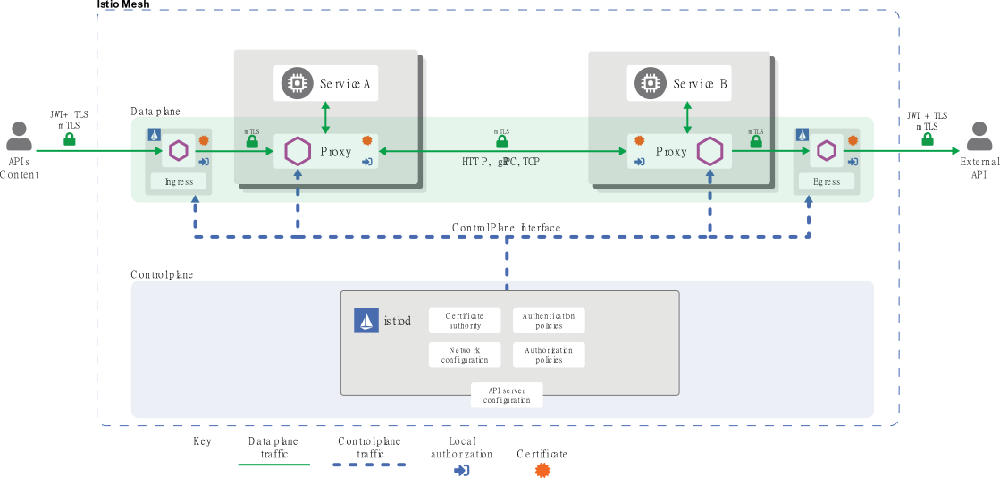

# 安全

将单体应用拆分为多个微服务，使系统具备了更好的灵活性、可伸缩性及功能复用的能力，但是服务间的调用却变得更加复杂、频繁。因此，微服务面对安全问题有着特殊的需求：

* 为了抵御中间人攻击，需要流量加密。
* 为了提供灵活的服务访问控制，需要双向 `TLS` 和细粒度的访问策略。
* 要确定谁在什么时候做了什么，需要审计工具。

对于 `Istio` 在安全性方面，也提供了全面的安全解决方案来解决上述这些问题，以确保服务能够在任何地方、任何场景下安全的运行。

`Istio` 安全功能提供强大的身份，强大的策略，透明的 `TLS`加密，认证，授权和审计工具来保护你的服务和数据。`Istio` 安全的目标是：

* 默认安全：应用程序代码和基础设施无需更改。
* 深度防御：与现有安全系统集成以提供多层防御。
* 零信任网络：在不受信任的网络上构建安全解决方案。

## 1、安全基础

在开始 `Istio` 安全性讨论之前，有必要先了解一下关于 `Istio` 安全层面的一些基础知识及相关概念，便于后续更深入的理解。

**认证和授权：**

在通信安全方面有两个最基本的概念：认证（`Authentication`）与授权（`Authorization`）。

**认证**是解决身份确认的问题，认证过程类似于身份证验证的过程。**授权**是解决权限管理的问题，只有拥有相应的权限才能进行权限范围内的操作。

**身份：**

身份（`identity`）是通信安全的基础，安全认证和授权过程中都会用到。在服务间通信开始阶段，通信双方需要交换包含各自身份标识的证书，并进行证书的双向验证。在客户端通过校验证书中的身份标识来确认这是否是它要访问的目标服务，而服务端则在认证客户端身份的同时，还能对该用户进行授权、审计等更为复杂的操作。

`Istio` 身份模型使用 `service identity` （服务身份）来确定一个请求源端的身份。这种模型有极好的灵活性和粒度，可以用服务身份来标识用户、单个工作负载或一组工作负载。在没有服务身份的平台上，`Istio` 可以使用其它可以对服务实例进行分组的身份，例如服务名称。

`Istio` 身份模型非常开放，可以复用业界主流云平台的服务身份，例如：

* `Kubernetes`：`Kubernetes Service Account`

* `GCP`：`GCP Service Account`

* `AWS`： `AWS IAM user/role account`
* 用户自定义服务账户。

## 2、安全实现

`Istio`中安全性主要是由控制平面中的 `Citadel` 实现，涉及有多个组件：

* 用于密钥和证书管理的证书颁发机构（`CA`）。
* 配置 API 服务器分发给代理：

  * 认证策略

  * 授权策略

  * 安全命名信息

* `Sidecar` 和边缘代理作为 `Policy Enforcement Points(PEPs)` 以保护客户端和服务器之间的通信安全。
* 一组 `Envoy` 代理扩展，用于管理遥测和审计。

控制平面处理来自 `API server` 的配置，并且在数据平面中配置 `PEPs`，`PEPs` 用 `Envoy` 实现。`Istio` 安全架构图如下所示：

