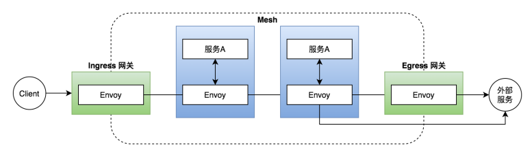

# Gateway

Gateway，一个运行在网格边缘的**负载均衡器**，定义了所有 `HTTP/TCP` 流量进出服务网格的统一进出口。它描述了一组对外公开的端口、协议、负载均衡、以及 SNI 配置。

`Istio Gateway` 包括 `Ingress Gateway` 与 `Egress Gateway`，分别用来配置网格的入口流量与出口流量。`Ingress Gateway` 使用 `istio-ingressgateway` 负载均衡器来代理流量，而 `istio-ingressgateway` 实际上是一个 `Envoy` 代理。



## 示例

一个简单示例如下：

```yaml
apiVersion: networking.istio.io/v1alpha3
kind: Gateway
metadata:
  name: my-gateway
  namespace: some-config-namespace
spec:
  selector:
    app: my-gateway-controller
  servers:
    - port:
        number: 80
        name: http
        protocol: HTTP
      hosts:
        - uk.bookinfo.com
        - eu.bookinfo.com
      tls:
        httpsRedirect: true # sends 301 redirect for http requests
    - port:
        number: 443
        name: https-443
        protocol: HTTPS
      hosts:
        - uk.bookinfo.com
        - eu.bookinfo.com
      tls:
        mode: SIMPLE # enables HTTPS on this port
        serverCertificate: /etc/certs/servercert.pem
        privateKey: /etc/certs/privatekey.pem
    - port:
        number: 9443
        name: https-9443
        protocol: HTTPS
      hosts:
        - "bookinfo-namespace/*.bookinfo.com"
      tls:
        mode: SIMPLE # enables HTTPS on this port
        credentialName: bookinfo-secret # fetches certs from Kubernetes secret
    - port:
        number: 9080
        name: http-wildcard
        protocol: HTTP
      hosts:
        - "ns1/*"
        - "ns2/foo.bar.com"
    - port:
        number: 2379 # to expose internal service via external port 2379
        name: mongo
        protocol: MONGO
      hosts:
        - "*"
```

该示例中， `Gateway` 被引用在 `some-config-namespace` 这个 `Namespace` 下，并使用 `label my-gateway-controller` 来关联部署网络代理的 `Pod` ，对外公开了 80、443、9443、9080、2379 端口的服务。

- 80 端口：附属配置的 `host` 为`uk.bookinfo.com`，`eu.bookinfo.com`，同时在 `tls` 中配置了 `httpsRedirect`。如果使用 `HTTP1.1` 协议访问将会返回 301，要求使用 `HTTPS` 访问，通过这种配置变相的禁止了对 `uk.bookinfo.com`，`eu.bookinfo.com` 域名的 `HTTP1.1` 协议的访问入口。
- 443 端口：提供`TLS/HTTPS` 的访问，表示接受 `uk.bookinfo.com`，`eu.bookinfo.com` 域名的 `HTTPS` 协议的访问，`protocol` 属性指定了协议类型。在 `tls` 的配置中指定了会话模式为单向 `TLS`（`mode: SIMPLE`） ，同时指定了服务端证书和私钥的存放地址。
- 9443 端口：提供`TLS/HTTPS` 的访问，与 443 端口不同的是证书不是指定存放证书文件的地址，而是通过 `credentialName` 属性配置从 `Kubernetes` 的证书管理中心拉取证书。
- 9080 端口：提供简单的 `HTTP1.1` 协议的访问。 `hosts` 中配置了 `ns1/*` 与 `ns2/foo.bar.com`，表示只允许`ns1` `Namespace` 下的 `VirtualService` 绑定它以及 `ns2` `Namespace`下配置了 `host` 为 `foo.bar.com` 的 `VirtualService` 绑定它。
- 2379 端口：提供 `MONGO` 协议的访问，允许所有 `host` 绑定它。

`Egress Gateway` 提供了对网格的出口流量进行统一管控的功能，在安装 `Istio` 时默认是不开启的。可以使用以下命令查看是否开启：

```sh
kubectl get pod -l istio=egressgateway -n istio-system
```

若没有开启，使用以下命令添加。

```sh
istioctl manifest apply --set values.global.istioNamespace=istio-system \
    --set values.gateways.istio-egressgateway.enabled=true
```

`Egress Gateway` 的一个简单示例如下：

```yaml
apiVersion: networking.istio.io/v1alpha3
kind: Gateway
metadata:
  name: istio-egressgateway
spec:
  selector:
    istio: egressgateway
  servers:
    - port:
        number: 80
        name: http
        protocol: HTTP
      hosts:
        - edition.cnn.com
```

可以看出，与 `Ingress Gateway`不同，`Egress Gateway` 使用有 `istio: egressgateway` 标签的 `Pod` 来代理流量，实际上这是一个 `Envoy` 代理。当网格内部需要访问 `edition.cnn.com` 这个地址时，流量将会统一先转发到 `Egress Gateway` 上，再由 `Egress Gateway` 将流量转发到 `edition.cnn.com` 上。
