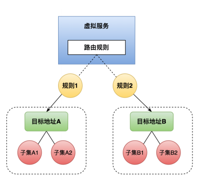

# VirtualService

`VirtualService` 与 `DestinationRule` 是流量控制最关键的两个自定义资源。在 `VirtualService` 中定义了**一组路由规则**，当流量进入时，逐个规则进行匹配，直到匹配成功后将流量转发给指定的路由地址。



## 示例

（以 `Bookinfo` 示例，将 `Reviews` 服务路由到`v1`版本）

```yaml
apiVersion: networking.istio.io/v1alpha3
kind: VirtualService
metadata:
  name: reviews
spec:
  hosts:
    - reviews
  http:
    - route:
        - destination:
            host: reviews
            subset: v1
---
apiVersion: networking.istio.io/v1alpha3
kind: DestinationRule
metadata:
  name: reviews
spec:
  host: reviews
  subsets:
    - name: v1
      labels:
        version: v1
```

**配置项说明：**

- `hosts`：用来配置下游访问的可寻址地址。配置一个 `String[]` 类型的值，可以配置多个。指定了发送流量的目标主机， 可以使用`FQDN`（`Fully Qualified Domain Name` - 全限定域名）或者短域名， 也可以一个前缀匹配的域名格式或者一个具体的 IP 地址。
- `match`：这部分用来配置路由规则，通常情况下配置一组路由规则，当请求到来时，自上而下依次进行匹配，直到匹配成功后跳出匹配。它可以对请求的 `uri`、`method`、`authority`、`headers`、`port`、`queryParams` 以及是否对 `uri` 大小写敏感等进行配置。
- `route`：用来配置路由转发目标规则，可以指定需要访问的 `subset` （服务子集），同时可以对请求权重进行设置、对请求头、响应头中数据进行增删改等操作。`subset` （服务子集）是指同源服务而不同版本的 `Pod`，通常在 `Deployment` 资源中设置不同的 `label` 来标识。

更多详细配置项说明参考：[https://istio.io/latest/zh/docs/reference/config/networking/virtual-service/#VirtualService](https://istio.io/latest/zh/docs/reference/config/networking/virtual-service/#VirtualService)
