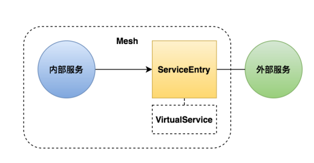

# ServiceEntry

`ServiceEntry` ，将网格外的服务注册到 `Istio` 的注册表中，这样就可以把外部服务当做网格内部的服务一样进行管理和操作。包括服务发现、路由控制等，在 `ServiceEntry` 中可以配置 `hosts`，`vips`，`ports`，`protocols`，`endpoints`等。



## 示例

它的一个简单示例如下：

```yaml
apiVersion: networking.istio.io/v1alpha3
kind: ServiceEntry
metadata:
  name: external-svc-https
spec:
  hosts:
    - api.dropboxapi.com
    - www.googleapis.com
    - api.facebook.com
  location: MESH_EXTERNAL
  ports:
    - number: 443
      name: https
      protocol: TLS
  resolution: DNS
```

该示例中，定义了在网格内部使用 `HTTPS` 协议访问外部的几个服务的配置。通过上面配置，网格内部的服务就可以把 `api.dropboxapi.com`，`www.googleapis.com`, `www.googleapis.com` 这几个外部的服务当做网格内部服务去访问。`MESH_EXTERNAL` 表示是网格外服务，该参数会影响到服务间调用的 `mTLS` 认证、策略执行等。
