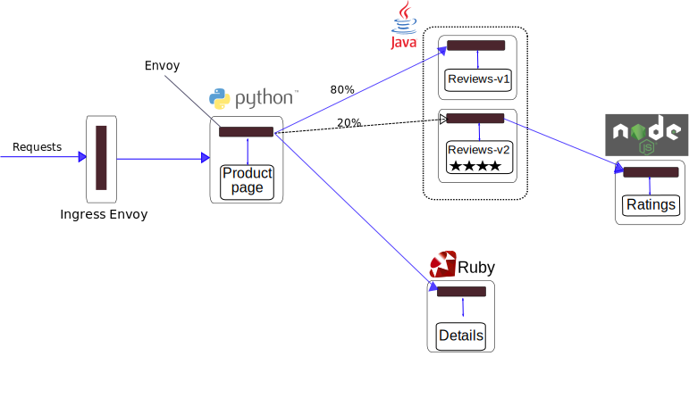

# 灰度发布

灰度发布，又叫做“金丝雀发布”，是指选择一小部分用户作为新版本的测试对象，当新版本运行稳定后，再逐步将更多的流量切换到新版本，直到将 100% 的流量都切换到新版本上，最后关闭剩下的老版本服务，完成灰度发布。

灰度发布，用来实现业务从老版本到新版本的平滑过渡，并避免升级过程中出现的问题对用户造成的影响。

> “金丝雀发布”，来源于矿工们用金丝雀对矿井进行空气测试的做法。以前矿工挖煤的时候，矿工下矿井前会先把金丝雀放进去，或者挖煤的时候一直带着金丝雀。金丝雀对甲烷和一氧化碳浓度比较敏感，会先报警。所以大家都用“金丝雀”来搞最先的测试。

例如，下图中，左下方的少部分用户就被当作“金丝雀”来用于测试新上线的 `1.1` 版本。如果新版本出现问题，“金丝雀”们会报警，但不会影响其他用户业务的正常运行。


灰度发布的流程如下：

- 准备和生产环境隔离的“金丝雀”服务器。
- 将新版本的服务部署到“金丝雀”服务器上。
- 对“金丝雀”服务器上的服务进行自动化和人工测试。
- 测试通过后，将“金丝雀”服务器连接到生产环境，将少量生产流量导入到“金丝雀”服务器中。
- 如果在线测试出现问题，则通过把生产流量从“金丝雀”服务器中重新路由到老版本的服务的方式进行回退，修复问题后重新进行发布。
- 如果在线测试顺利，则逐渐把生产流量按一定策略逐渐导入到新版本服务器中。
- 待新版本服务稳定运行后，删除老版本服务。

## 1、Istio 中灰度发布的实现

灰度发布的实现，核心技术是要提供一种机制满足多不版本同时在线，并能够灵活配置规则给不同的版本分配流量。

`Istio` 本身并没有关于灰度发布的规则定义，灰度发布只是流量管控规则的一种典型应用，在进行灰度发布时，只要写个简单的流量规则配置（ `VirtualService` 规则配置）即可。

`Istio` 在每个 `Pod` 里都注入了一个 `Envoy`，因而只要在控制面配置分流策略，对目标服务发起访问的每个 `Envoy` 便都可以执行流量策略，完成灰度发布功能。

`Istio` 灰度发布支持两类灰度策略：

- 基于流量比例的策略：配置 `VirtualService` 中的路由权重 `weight` 来实现基于流量比例的灰度发布。
- 基于请求内容的策略：配置 `VirtualService` 中的路由请求头 `headers` 来实现基于请求内容的策略。该策略是非常灵活的，比如某个特性是专门为 `Mac` 操作系统开发的，则在该版本的流量策略中需要匹配请求方的操作系统。浏览器、请求的 `Headers` 等请求内容在 `Istio` 中都可以作为灰度发布的特征条件。

> 采用 `kubernetes` 的滚动升级(`rolling update`)功能也可以实现不中断业务的应用升级，但滚动升级是通过逐渐使用新版本的服务来替换老版本服务的方式对应用进行升级，在滚动升级不能对应用的流量分发进行控制，因此无法采用受控地把生产流量逐渐导流到新版本服务中，也就无法控制服务升级对用户造成的影响。

## 2、灰度发布示例

下面采用 `Istio` 官方提供的 `BookInfo` 示例来验证灰度发布的流程，实现将 `reviews` 服务从 `v1` 版本逐渐灰度替换到 `v2` 版本，如将流量从 20% 逐步路由到 `v2` 版本，如下图所示：



1. **部署 `v1` 版本的服务**

   部署 `BookInfo` 示例中所有服务（`productpage`、`details`、`reviews-v1`、`ratings`）

   1）只部署 `revices` 服务的 `v1` 版本，则需将 `samples/bookinfo/platform/kube/bookinfo.yaml` 中关于 `reviews` 服务的 `v2` 、`v3`版本去除，通过 `kubectl apply` 命令部署：

   ```sh
   kubectl apply -f samples/bookinfo/platform/kube/bookinfo.yaml
   ```

   2）通过 `kubectl` 命令行确认 pod 部署，可以看到只有 V1 版本的服务：

   ```sh
   $ kubectl get pods
   ……
   ```

   3）为了能够外部访问，则为应用程序定义 `Ingress` 网关：

   ```sh
   kubectl apply -f samples/bookinfo/networking/bookinfo-gateway.yaml
   ```

   4）用浏览器打开网址 `http://<EXTERNAL-IP>/productpage`，（`EXTERNAL-IP` 是 `istio-ingress` 的 `External IP`）来浏览应用的 `Web` 页面。由于 `V1` 版本的 `reviews` 服务并不会调用 `rating` 服务，因此可以看到 `Product` 页面显示的是不带星级的评价信息。

2. **部署 `v2` 版本的 `reviews` 服务**

   1）部署 `reviews` 服务的 `v2` 版本之前，需要创建路由规则（`VirtualService`、`DestinationRule`），确保将所有流量都路由到 `v1`，避免新版本 `v2` 对线上用户造成影响。

   ① 根据 `samples/bookinfo/networking/virtual-service-all-v1.yaml` 创建 `VirtualService`，将请求都路由到所有服务的 `v1` 版本：

   ```yaml
   apiVersion: networking.istio.io/v1alpha3
   kind: VirtualService
   metadata:
     name: productpage
   spec:
     hosts:
       - productpage
     http:
       - route:
           - destination:
               host: productpage
               subset: v1
   ---
   apiVersion: networking.istio.io/v1alpha3
   kind: VirtualService
   metadata:
     name: reviews
   spec:
     hosts:
       - reviews
     http:
       - route:
           - destination:
               host: reviews
               subset: v1
   ---
   apiVersion: networking.istio.io/v1alpha3
   kind: VirtualService
   metadata:
     name: ratings
   spec:
     hosts:
       - ratings
     http:
       - route:
           - destination:
               host: ratings
               subset: v1
   ---
   apiVersion: networking.istio.io/v1alpha3
   kind: VirtualService
   metadata:
     name: details
   spec:
     hosts:
       - details
     http:
       - route:
           - destination:
               host: details
               subset: v1
   ---
   ```

   通过 `kubectl apply` 命令创建该 `VirtualService`：

   ```sh
   kubectl apply -f samples/bookinfo/networking/virtual-service-all-v1.yaml
   ```

   ② 根据 `samples/bookinfo/networking/destination-rule-all.yaml` 创建 `DestinationRule`，配合 `VirtualService` 实现流量路由到 `reviews` 服务的 `v2` 版本，将其中无关内容删除，最终配置如下：

   ```yaml
   apiVersion: networking.istio.io/v1alpha3
   kind: DestinationRule
   metadata:
     name: productpage
   spec:
     host: productpage
     subsets:
       - name: v1
         labels:
           version: v1
   ---
   apiVersion: networking.istio.io/v1alpha3
   kind: DestinationRule
   metadata:
     name: reviews
   spec:
     host: reviews
     subsets:
       - name: v1
         labels:
           version: v1
       - name: v2
         labels:
           version: v2
   ---
   apiVersion: networking.istio.io/v1alpha3
   kind: DestinationRule
   metadata:
     name: ratings
   spec:
     host: ratings
     subsets:
       - name: v1
         labels:
           version: v1
   ---
   apiVersion: networking.istio.io/v1alpha3
   kind: DestinationRule
   metadata:
     name: details
   spec:
     host: details
     subsets:
       - name: v1
         labels:
           version: v1
   ---
   ```

   通过 `kubectl apply` 命令创建该 `DestinationRule`：

   ```sh
   kubectl apply -f samples/bookinfo/networking/destination-rule-all.yaml
   ```

   2）部署 `reviews` 服务的 `v2` 版本：

   ```sh
   kubectl apply -f samples/bookinfo/platform/kube/bookinfo-reviews-v2.yaml
   ```

   此时系统中部署了 `v1` 和 `v2` 两个版本的 `reviews` 服务，但所有的业务流量都被路由到 `reviews` 服务的 `v1` 版本。

3. **将测试流量导入到 `v2` 版本的 `reviews` 服务**

   基于 `istio` 请求内容的路由规则策略，将部分用户的流量切换到 `reviews` 服务的 `v2` 版本，以最小化模拟测试对已上线业务的影响。

   1）修改 `reviews` 的 `VirtualService`的路由规则，将用户名为 `jason` 的流量路由到 `reviews` 服务的 `v2` 版本，即：可使用示例中的 `samples/bookinfo/networking/virtual-service-reviews-test-v2.yaml`，内容如下：

   ```yaml
   apiVersion: networking.istio.io/v1alpha3
   kind: VirtualService
   metadata:
     name: reviews
   spec:
     hosts:
       - reviews
     http:
       - match:
           - headers:
               end-user:
                 exact: jason
         route:
           - destination:
               host: reviews
               subset: v2
       - route:
           - destination:
               host: reviews
               subset: v1
   ```

   通过 `kubectl apply` 命令创建该 `VirtualService`：

   ```sh
   kubectl apply -f samples/bookinfo/networking/virtual-service-reviews-test-v2.yaml
   ```

   2）以用户 `jason` 登录 `productpage` 页面，可以看到 `reviews` 服务的 `V2` 版本带星级的评价页面。而注销用户 `jason`，即：不登录用户，则是 `v1` 版本无星级的评价页面。由此，说明基于 `istio` 请求内容的路由规则策略生效，实现了将部分用户的流量切换到了 `v2` 版本。

4. **将部分流量路由到 `v2` 版本的 `reviews` 服务**

   在线上模拟测试完成后，如果系统测试情况良好，可以通过规则将一部分用户流量导入到 `v2` 版本的服务中，进行小规模的灰度测试。

   修改 `reviews` 的 `VirtualService`的路由规则，将 `20%` 的流量路由到 `v2` 版本。

   > 备注：本例只是描述原理，因此为简单起见，将 `20%` 流量路由`v2` 版本，在实际操作中，更可能是先导入较少流量，然后根据监控的新版本运行情况将流量逐渐导入，如采用 `5%`，`10%`，`20%`，`50%` …的比例逐渐导入。

   即：可使用示例中的 `samples/bookinfo/networking/virtual-service-reviews-80-20.yaml`，内容如下：

   ```yaml
   apiVersion: networking.istio.io/v1alpha3
   kind: VirtualService
   metadata:
     name: reviews
   spec:
     hosts:
       - reviews
     http:
       - route:
           - destination:
               host: reviews
               subset: v1
             weight: 80
           - destination:
               host: reviews
               subset: v2
             weight: 20
   ```

   通过 `kubectl apply` 命令创建该 `VirtualService`：

   ```sh
   kubectl apply -f samples/bookinfo/networking/virtual-service-reviews-80-20.yaml
   ```

   此时，会有 `20%` 的流量路由到 `v2` 版本。

5. **将所有生产流量路由到 `v2` 版本的 `reviews` 服务**

   如果新版本 `v2` 的服务运行正常，则可以将所有流量路由到 `v2` 版本。

   ```yaml
   apiVersion: networking.istio.io/v1alpha3
   kind: VirtualService
   metadata:
     name: reviews
   spec:
     hosts:
       - reviews
     http:
       - route:
           - destination:
               host: reviews
               subset: v2
   ```

6. **删除 `v1` 版本的 `reviews` 服务**

   待 `v2` 版本上线稳定运行后，删除 `v1` 版本的 `reviews` 服务。

   （`<reviews-v1-podname>` 指 `v1` 版本的 `reviews` 服务的 `Pod` 名。 ）

   ```sh
   kubectl delete pod <reviews-v1-podname>
   ```
